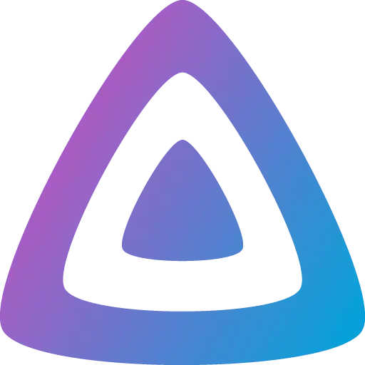
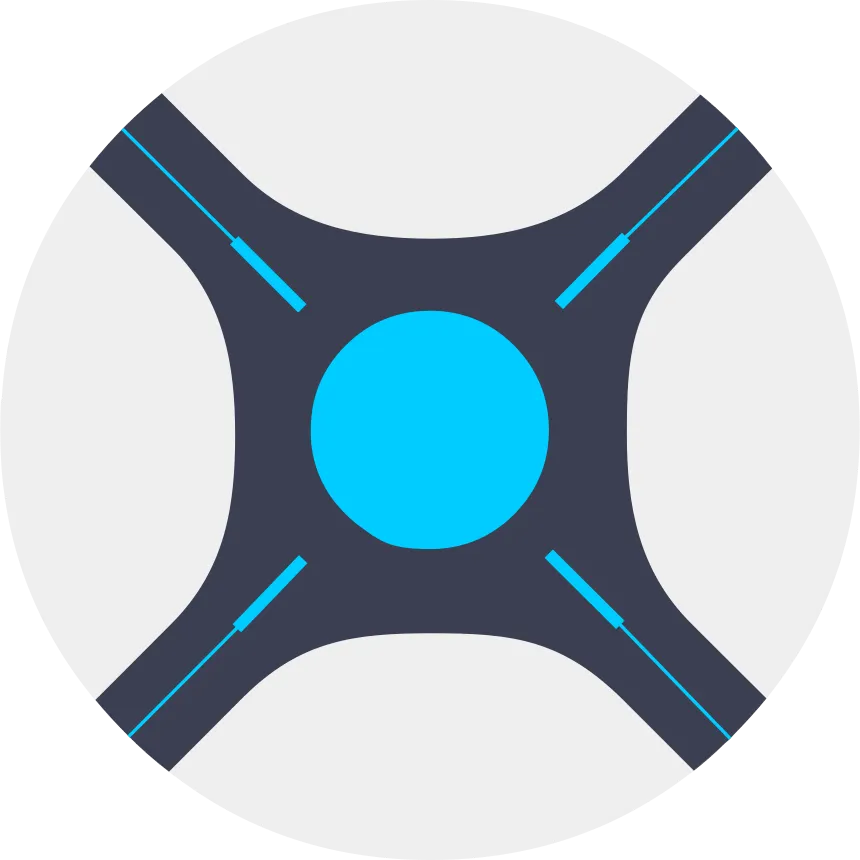

# Server Links

Where I will try to keep an up to date list of services that you can use on my server

---

{: .warning }
> Some of these links or services may not work, as being a server admin is very time consuming I guess and I keep trying to add stuff which breaks other things

{: .new-title }
> Quick Note
>
> Not all these services are publicly usable, as they require a level of trust, if you want to get access to some of these services, just make sure to contact me first

[{: width="20" }](https://discordapp.com/users/714918826831118436)
[Discord](https://discordapp.com/users/714918826831118436)

[{: width="20" }](https://signal.me/#eu/14nA-tBiLDlv3Z1DzDlmNSd_hpqwEk2EcjhmY0uWcjbTAQWx9NZGiJfkVOkMR4mS)
[Signal](https://signal.me/#eu/14nA-tBiLDlv3Z1DzDlmNSd_hpqwEk2EcjhmY0uWcjbTAQWx9NZGiJfkVOkMR4mS)

# Media streaming:
## [Jellyfin](https://jellyfin.happylizard.me) [{: width="30" }](https://jellyfin.happylizard.me)
 [Jellyfin Website](https://jellyfin.org/)

# File server:
## [Copyparty 🎊](https://copyparty.happylizard.me)

# Rstack (trusted only):
## [Radarr](https://radarr.teto.beer) [{: width="30" }](https://radarr.teto.beer)

## [Sonarr](https://sonarr.teto.beer) [{: width="30" }](https://sonarr.teto.beer)

## [Lidarr](https://lidarr.teto.beer) [{: width="30" }](https://lidarr.teto.beer)

# Others:
## [Portal Runner Converter](https://convert.happylizard.me)

## [Happy Ripper](https://ethanis.gay)
